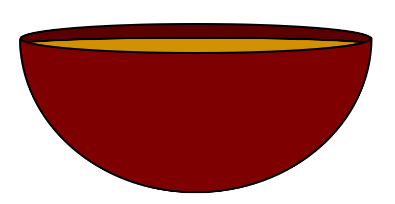

## Soup
###### Ver 0.1.1



This is a programming language written in Go as being the third rewrite that is currently interpreted with a similar syntax to javascript.

### Building

Building this language's core is simple. You need to have [Golang](https://go.dev/dl/) installed and from the main "Soup" folder you need to run "scripts/build" and it will build all the binaries related to soup and add them to the bin folder.


### Commands

The Soup langauge has a tool called spoon. This tool is to help with builing, downloadling, and installing soup packages/modules.

A few spoon commands that exist are:

Create Base for project
`spoon.exe init_pkg {name} {desc}`

Get Package From Github
`spoon.exe get {github_repo_url}`

Get Project Dependencies
`spoon.exe get_dep`

Send project to main PKG folder
`spoon.exe add_pkg`


### Code Example

test.soup
```soup

    func hello_world(){

        val text = `Hello World`
        return text;

    }

    println(hello_world())

```