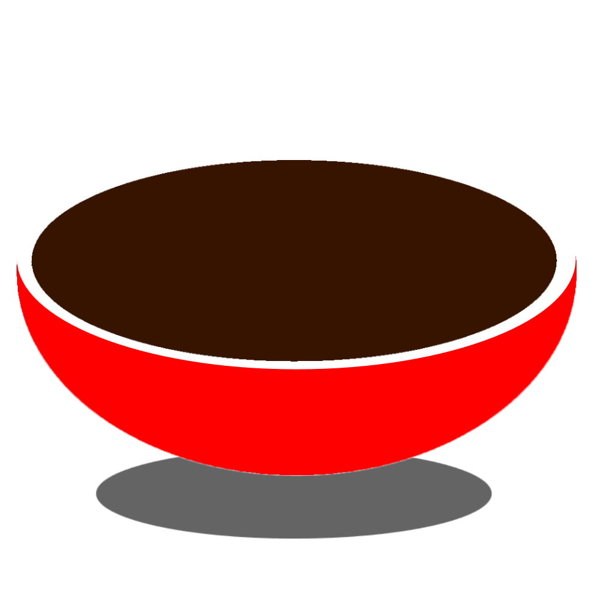

## Soup

##### Version 0.0.1 - [Golang](https://github.com/ZombiiTheCoder/SoupLang) Alpha
##### Version 0.0.6 - [TypeScript](https://github.com/ZombiiTheCoder/Soup) Alpha

<!-- <link rel="stylesheet" href="https://raw.githubusercontent.com/ZombiiTheCoder/SoupLang/master/docs/prism.css">
<script src="https://raw.githubusercontent.com/ZombiiTheCoder/SoupLang/master/docs/prism.js"></script> -->



This is a programming language formerly written in TypeScript that can be use for many things but the limitation is that it is currently interpreted and may become compiled in the future.

The Current Lexer Is On Version 2 hece the name [Lex2](./src/lex2/) no longer requiring [Lexer 1's](./src/lexer/) objects and methods

### Building

To build Soup you need to have the prerequisite [Golang](https://go.dev/dl/) installed

Next after go is installed go to this folder in your terminal and type `go build .` to build a binary for Soup.

### Installing

Soup will have an installer soon so you can use soup from anywhere.
```soup

    use `@std`

    fn hello_world(){

        val text = `Hello World`
        return text

    }

    std.io.println(hello_world())

```